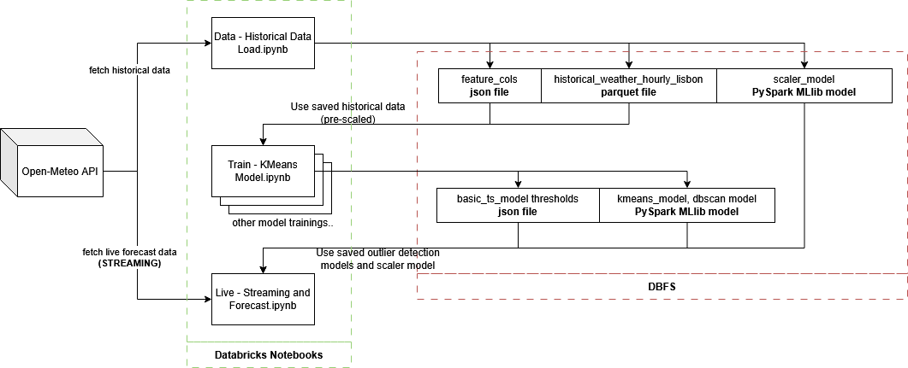

# Big Data Analytics Project

This project was developed as part of the **Big Data Analytics** course in the **Masters in Data Science and Advanced Analytics** program at **Universidade NOVA de Lisboa**.

## Group Members

- Guilherme Cordeiro (20240527)
- Maria Radix (20240687)
- Carolina Pinto (20240494)
- Louis Berthele (20240552)

## System Architecture

The image below illustrates the **system architecture** designed and implemented as part of the project. Data is fetched from Open-Meteo both in a bigger batch as historical, training data and in a smaller batch as live / forecasted weather data.

- The notebook **"EDA"** explores the data and fields obtained by Open-Meteo's API to determine which will be used in the scope of this project.
- The notebook **"Data - Historical Data Load"** loads historical weather data, vectorizes and assembles the training data set and saves it in DBFS to be later used by the model training notebooks.
- The notebook(s) **"Train - X Model"** Use the previously loaded data to train outlier detection models, later to be used by the streaming notebook.
- The notebook **"Live - Streaming and Forecast"** fetches live forecast data and uses the best outlier detection model to flag outliers and visualize the next few days.

